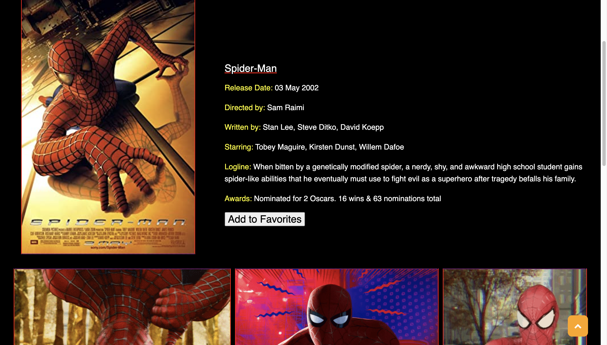
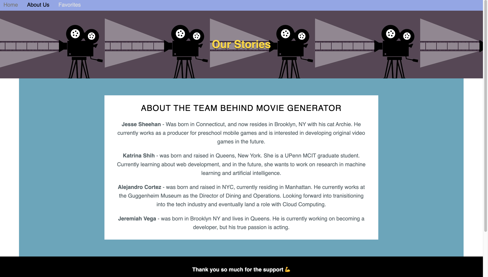
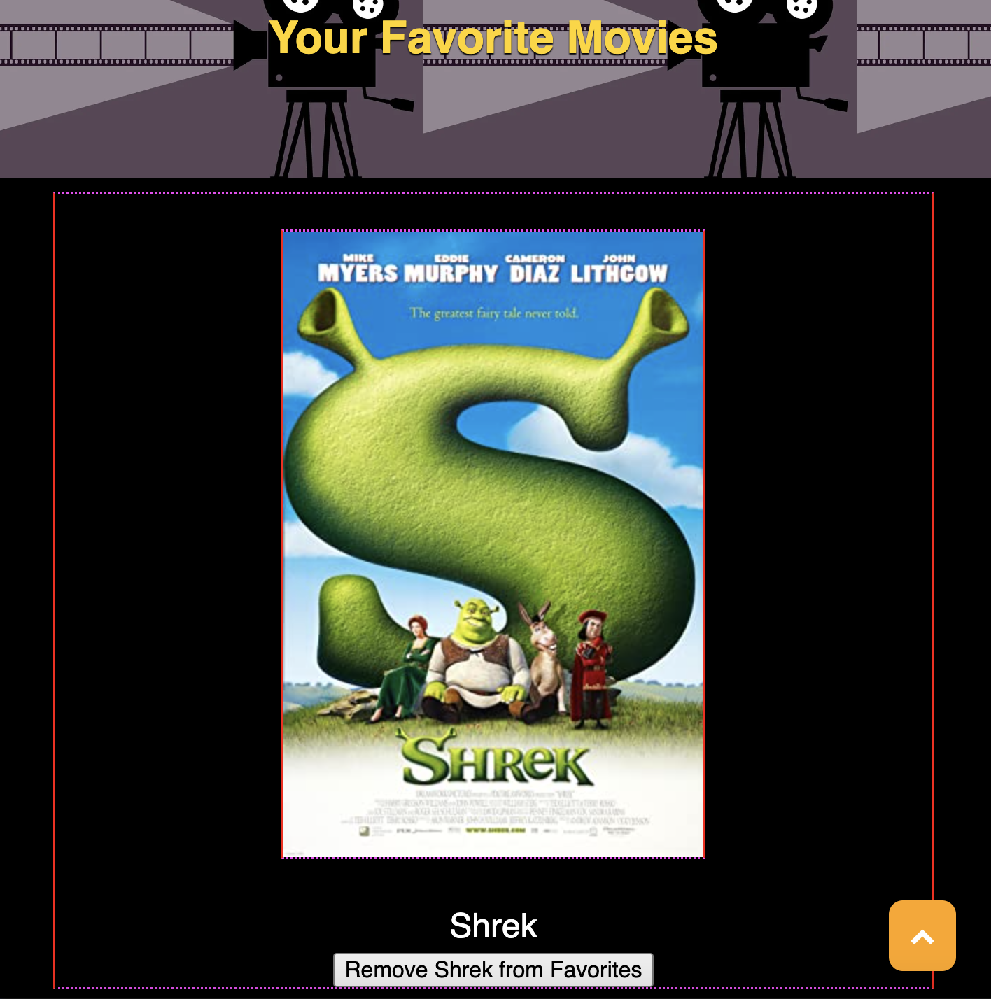

# Team 3 Media-generator
Our GitHub Profile

* Jesse
https://github.com/sweetfreak

* Katrina
https://github.com/kattheswagger1122

* Alejandro
https://github.com/Muzan67

* Jeremiah
https://github.com/jmvega316

# 7. Interactive Front-End Project
Our group used everything we’ve learned over the past six weeks to create a real-world front-end application that we will be able to showcase to potential employers. The requirements for this project are to use the skills and technologies we’ve learned over the past six weeks (deployment, interactivity, client-side storage, responsive design, polished UI).

The lessons and Challenge assignments have reinforced the importance of quality coding standards and best practices for repositories and READMEs. Use these skills to create a professional and impressive application that you could present with pride to any potential employer.

## Review

* The URL of the deployed application: 


* The URL of the GitHub repository. Give the repository a unique name and include a high-quality README describing the project.:

https://github.com/sweetfreak/media-generator.git

## User Story
```
AS A USER, I want to learn about a movie and get detailed information.
GIVEN I know the title of the movie I want to learn about
WHEN I enter the name of the movie and click a submit button
THEN I am presented with movie poster, review, and streaming sites.
~~~~
```

## Technical Acceptance Criteria
```
Application uses at least two server-side APIs.

Application uses client-side storage to store persistent data.

Application doesn't use JS alerts, prompts, or confirms (uses modals instead).

Application uses a CSS framework other than Bootstrap.

Application is interactive (accepts and responds to user input)
```

## Project Requirement
```
Your project should fulfill the following requirements:

Use a CSS framework other than Bootstrap.

Be deployed to GitHub Pages.

Be interactive (i.e., accept and respond to user input).

Use at least two server-side APIs.

Does not use alerts, confirms, or prompts (use modals).

Use client-side storage to store persistent data.

Be responsive.

Have a polished UI.

Have a clean repository that meets quality coding standards (file structure, naming conventions, follows best practices for class/id naming conventions, indentation, quality comments, etc.).

Have a quality README (with unique name, description, technologies used, screenshot, and link to deployed application).
```

## Screenshots of the page

1. Media Home Page


2. Movie Results Page: with movie information and related images


3. About our team page


4. Add to favorites Page



## Credits and references
1. Source for the cursor on our project.
https://www.cursor.cc/?action=icon&file_id=95108

2. OMDB Media API: The Open Movie Database
https://www.omdbapi.com/
3. Gif API: Image Source
https://developers.giphy.com/


4. Wireframe: CSS framework 
https://www.purecss.io

5. CSS fonts and Style
https://www.w3schools.com/default.asp
